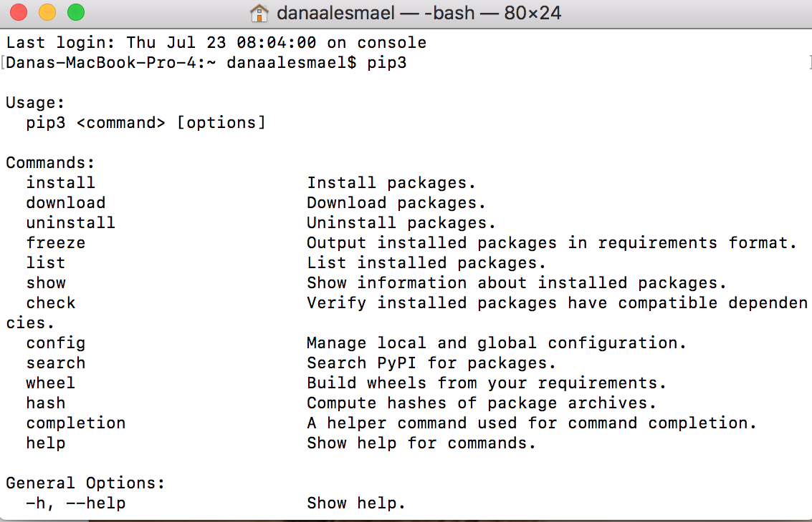
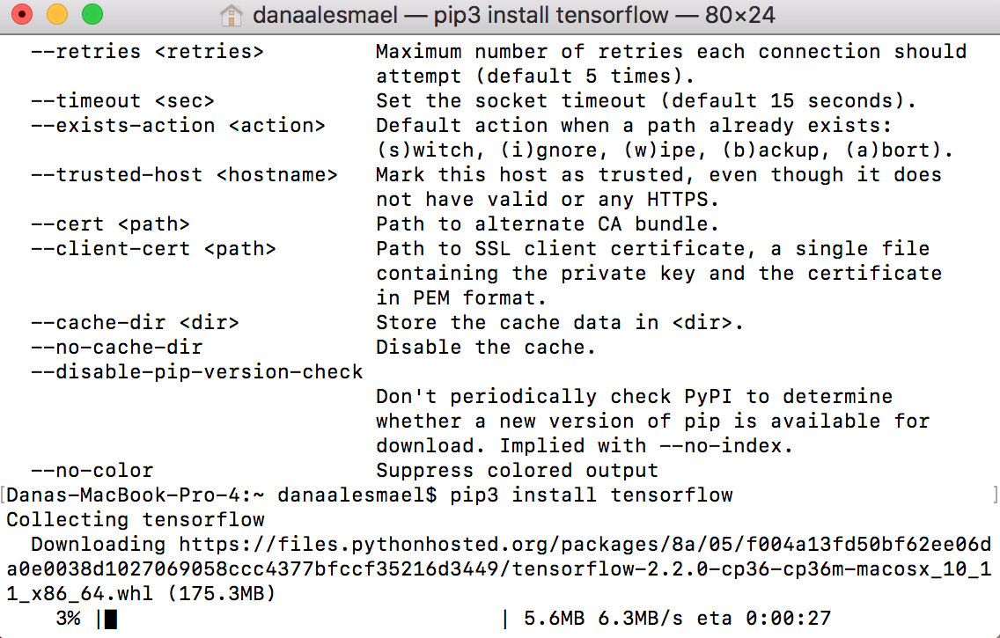
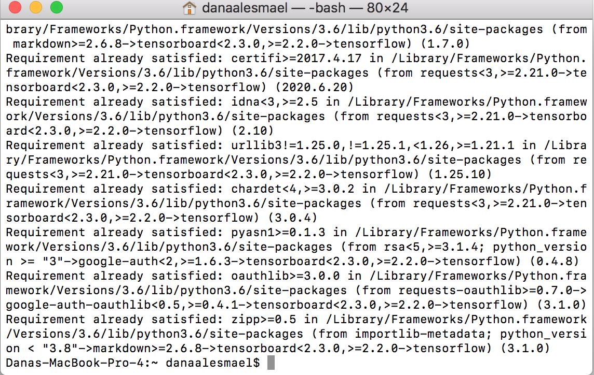
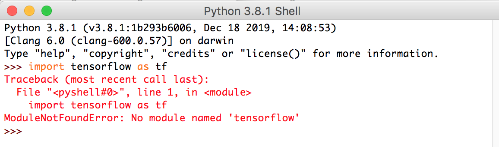

# ObjectDetection-TensorFlow

"TensorFlow is a free and open-source software library for dataflow and differentiable programming across a range of tasks". In order for this software to be downloaded, an easy way can be done which can be explained as following: 

* A terminal should be opened to check the installation of Python's pip package manager. 

* TensorFlow can installed by typing the following comand: pip3 install tensorflow.

* Check if the installation process was done correctly by opening idle and typing (import tensorflow as tf). No error messages should be shown. If by any chance the program did not identify tensorflow, as shown in the figure below, various steps should be followed. 

Steps: 
1. 
